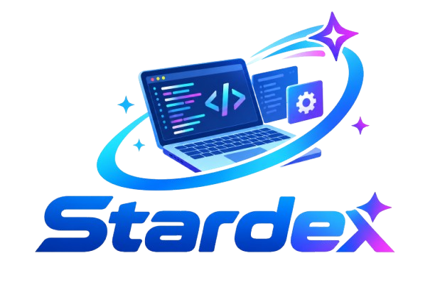
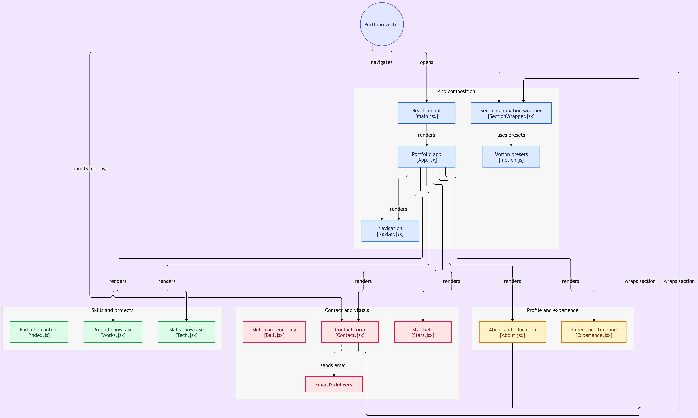

<p align="center" style="margin:0; padding:0;">
  
</p>

<h1 align="center">🌍 Stardex — A Personal Portfolio</h1>

<p align="center">
  <strong>A modern, responsive personal portfolio built with React, Tailwind CSS, and Framer Motion</strong>
</p>

<p align="center">
  A sleek developer portfolio showcasing projects, technical skills, professional experience,
  education, and an interactive contact experience with modern animations.
</p>

<p align="center">
  <a href="https://stardex-sifat.netlify.app/">
    
  </a>
  <a href="https://github.com/sifatahammed/Stardex-A-Personal-Portfolio">
    
  </a>
</p>

<p align="center">
  <a href="https://react.dev/">
    
  </a>
  <a href="https://tailwindcss.com/">
    
  </a>
  <a href="https://www.framer.com/motion/">
    
  </a>
  <a href="https://vitejs.dev/">
    
  </a>
  <a href="https://www.emailjs.com/">
    
  </a>
  <a href="LICENSE">
    
  </a>
</p>

---

## ✨ About Stardex

**Stardex** is a modern personal portfolio website designed to present my work,
skills, experience, education, and professional journey in an engaging and interactive way.

The portfolio combines a clean developer-focused interface with animated UI elements,
interactive project cards, visual skill representations, responsive layouts, and a functional
contact form powered by EmailJS.

The goal of Stardex is to provide visitors with a quick and visually appealing overview of
my capabilities as a **Full Stack Developer**, with a particular interest in modern frontend
technologies and AI-powered applications.

---

## 🚀 Live Demo

🌐 **Portfolio:**  
https://stardex-sifat.netlify.app/

---

## 🎯 Portfolio Highlights

- 👨‍💻 Full Stack Developer portfolio
- ⚛️ Component-based React architecture
- 🎨 Modern Tailwind CSS interface
- ✨ Smooth Framer Motion animations
- 📱 Fully responsive design
- 🧩 Reusable section wrapper components
- 💼 Interactive project showcase
- 🛠️ Animated technology/skill showcase
- 🎓 Education and professional experience timeline
- 📬 Functional EmailJS contact form
- ⭐ Animated background/star-field visual
- 🎭 Interactive 3D-style skill visualization
- ⚡ Fast Vite development environment
- 📂 Organized and scalable project structure

---

# 🏗️ Application Architecture

The portfolio follows a component-based React architecture where the main application
renders individual portfolio sections through reusable components.

### Architecture Overview

```text
Portfolio Visitor
       │
       ├── Navigates
       │      │
       │      ▼
       │   Navigation
       │   [Navbar.jsx]
       │
       └── Opens Portfolio
              │
              ▼
        React Mount
        [main.jsx]
              │
              ▼
        Portfolio App
          [App.jsx]
              │
       ┌──────┼───────────────────────┐
       │      │          │            │
       ▼      ▼          ▼            ▼
    Skills  Contact   Profile      Experience
    & Work  & Visuals & Education    Timeline
```
# 📐 Visual Architecture Diagram

<p align="center">
  
</p>

The application is organized into several major sections:

| Section | Component | Purpose |
| :--- | :--- | :--- |
| **Navigation** | `Navbar.jsx` | Handles portfolio navigation |
| **Portfolio** | `App.jsx` | Main application composition |
| **Skills** | `Tech.jsx` | Displays technical skills |
| **Projects** | `Works.jsx` | Showcases development projects |
| **About** | `About.jsx` | Personal introduction and education |
| **Experience** | `Experience.jsx` | Professional experience timeline |
| **Contact** | `Contact.jsx` | Contact form and communication |
| **Skills Visualization** | `Ball.jsx` | Interactive skill/icon visualization |
| **Background** | `Stars.jsx` | Animated visual background |
| **Animation** | `SectionWrapper.jsx` | Reusable section animation wrapper |
| **Motion** | `motion.js` | Shared Framer Motion animation presets |
| **Email** | `EmailJS` | Sends messages from the contact form |

---

## 🧩 Component Flow

The application starts from the React entry point:

```text
main.jsx
   │
   ▼
App.jsx
   │
   ├── Navbar.jsx
   │
   ├── SectionWrapper.jsx
   │      └── motion.js
   │
   ├── About.jsx
   │
   ├── Experience.jsx
   │
   ├── Tech.jsx
   │      └── Ball.jsx
   │
   ├── Works.jsx
   │
   ├── Contact.jsx
   │      └── EmailJS
   │
   └── Stars.jsx
```

This structure keeps the portfolio modular and makes it easier to add or modify sections without affecting the entire application.

---

## ✨ Features

### 📱 Fully Responsive Design

Stardex is designed to provide a seamless experience across:

* 📱 Mobile devices
* 📲 Tablets
* 💻 Laptops
* 🖥️ Desktop displays
* 🖥️ Large-screen monitors

Layouts, typography, navigation, cards, and animations adapt to different screen sizes.

### 🎨 Modern UI/UX

The portfolio focuses on a clean and immersive developer experience.

**UI Features:**
* Modern dark-themed interface
* Responsive navigation
* Smooth scrolling
* Interactive cards
* Visual technology showcase
* Animated backgrounds
* Clean typography
* Consistent spacing
* Modern hover effects
* Responsive section layouts

### 🎥 Framer Motion Animations

Framer Motion is used to create smooth interactions throughout the website.

**Animations include:**
* Section entrance animations
* Fade-in effects
* Slide transitions
* Hover interactions
* Scroll-based animations
* Animated project elements
* Interactive UI transitions

Reusable animation presets are maintained inside:
`src/utils/motion.js`

This allows different sections to share consistent animation behavior.

### 🛠️ Interactive Skills Showcase

The skills section provides a visual representation of the technologies used throughout my development journey.

Technologies can be presented through interactive visual elements, including the animated skill/icon visualization powered by `Ball.jsx`. This creates a more engaging alternative to a traditional list of technologies.

### 💼 Project Showcase

The project section highlights selected development projects with:
* Project title
* Description
* Technology stack
* Project preview
* Source code
* Interactive UI elements

Projects are organized through `Works.jsx`.

### 📚 Profile & Experience

The portfolio includes dedicated sections for:

* **About (`About.jsx`)**: Provides information about personal background, education, developer profile, and areas of interest.
* **Experience (`Experience.jsx`)**: Displays professional experience through an interactive timeline.

## 📬 Contact Form

The contact section provides visitors with a convenient way to send messages directly from the portfolio.

The form uses **EmailJS**.

### Contact Flow

```
Visitor
   │
   ▼
Contact Form
   │
   ▼
EmailJS
   │
   ▼
Email Delivery
   │
   ▼
Portfolio Owner
```

> **Note:** No traditional backend server is required for the email delivery workflow.

---

## 🧰 Tech Stack

| Technology | Purpose |
| :--- | :--- |
| ⚛️ **React.js** | Frontend framework |
| 🎨 **Tailwind CSS** | Styling and responsive UI |
| 🎥 **Framer Motion** | Animations and transitions |
| ⚡ **Vite** | Development and build tooling |
| 📬 **EmailJS** | Contact form email delivery |
| 🔐 **dotenv** | Environment variable management |
| 🧩 **JavaScript / JSX** | Application development |
| 📦 **npm** | Package management |
| 🌐 **Netlify** | Deployment |

---

## 📂 Project Structure

```text
Stardex/
│
├── public/
│   ├── logo.png
│   └── architecture.png
│
├── src/
│   ├── assets/
│   ├── components/
│   ├── constants/
│   ├── hoc/
│   ├── pages/
│   ├── styles/
│   ├── utils/
│   │   └── motion.js
│   ├── App.jsx
│   └── main.jsx
│
├── .gitignore
├── .env
├── README.md
├── package.json
└── package-lock.json
```

## ⚙️ Installation & Setup

### 1️⃣ Clone the Repository
```bash
git clone https://github.com/sifatahammed/Stardex-A-Personal-Portfolio.git
```

### 2️⃣ Navigate to the Project
```bash
cd Stardex-A-Personal-Portfolio
```

### 3️⃣ Install Dependencies
```bash
npm install
```

### 4️⃣ Configure Environment Variables

Create a `.env` file in the project root:

```env
VITE_EMAILJS_SERVICE_ID=your_service_id
VITE_EMAILJS_TEMPLATE_ID=your_template_id
VITE_EMAILJS_PUBLIC_KEY=your_public_key
```

> ⚠️ **Warning:** Never commit your `.env` file or private credentials to GitHub.

### 5️⃣ Start the Development Server
```bash
npm run dev
```

### 6️⃣ Open the Application

Vite will provide a local development URL, usually:
`http://localhost:5173`

---

## 🔐 Environment Variables

The following environment variables are used for EmailJS integration:

| Variable | Description |
| :--- | :--- |
| `VITE_EMAILJS_SERVICE_ID` | EmailJS service identifier |
| `VITE_EMAILJS_TEMPLATE_ID` | EmailJS email template identifier |
| `VITE_EMAILJS_PUBLIC_KEY` | EmailJS public key |

---

## 📦 Build for Production

Create an optimized production build:
```bash
npm run build
```

Preview the production build locally:
```bash
npm run preview
```

---

## 🌐 Deployment

The portfolio can be deployed using platforms such as:
* Netlify
* Vercel
* GitHub Pages
* Cloudflare Pages

The current live version is deployed on **Netlify**.

🔗 **Live Production URL:** [https://stardex-sifat.netlify.app/](https://stardex-sifat.netlify.app/)

---

## 📸 Portfolio Sections

The website is organized around several key sections:

```text
┌─────────────────────────────────┐
│          Navigation             │
├─────────────────────────────────┤
│          Hero / Intro           │
├─────────────────────────────────┤
│        About & Education        │
├─────────────────────────────────┤
│       Experience Timeline       │
├─────────────────────────────────┤
│       Technical Skills          │
├─────────────────────────────────┤
│        Project Showcase         │
├─────────────────────────────────┤
│        Contact Form             │
├─────────────────────────────────┤
│             Footer              │
└─────────────────────────────────┘
```

---

## ⚡ Performance & Development

Stardex is structured around reusable React components to make the application easier to maintain and extend.

### Development Principles
* ♻️ **Reusable components**
* 🧩 **Modular architecture**
* 📱 **Responsive-first development**
* 🎨 **Consistent design system**
* ⚡ **Fast development with Vite**
* ✨ **Reusable animation presets**
* 🔐 **Environment-based configuration**
* 📂 **Organized source structure**

---

## 🔮 Future Improvements

Potential future enhancements include:

- [ ] Blog / Articles section
- [ ] Dark / Light theme switcher
- [ ] CMS integration
- [ ] Project filtering by technology
- [ ] Advanced project case studies
- [ ] GitHub API integration
- [ ] Downloadable resume
- [ ] Visitor analytics
- [ ] Improved accessibility
- [ ] SEO optimization
- [ ] Progressive Web App support
- [ ] Internationalization / multiple languages

## 👨‍💻 Author

<p align="center">
  <strong>MD Sifat Ahammed Akash</strong>
</p>
<p align="center">
  Full-Stack Developer • React Developer • AI/ML Enthusiast
</p>
<p align="center">
  <a href="mailto:sifatahammed821@gmail.com">
    
  </a>
  <a href="https://github.com/sifatahammed">
    
  </a>
</p>


## 📄 License

<div align="center">

MIT License © MD Sifat Ahammed Akash
</div>
<div align="center">
⭐ If you find Stardex useful, consider giving the repository a Star!<br>

<p align="center">
Built with ❤️ using React, Tailwind CSS & Framer Motion.
</p>

